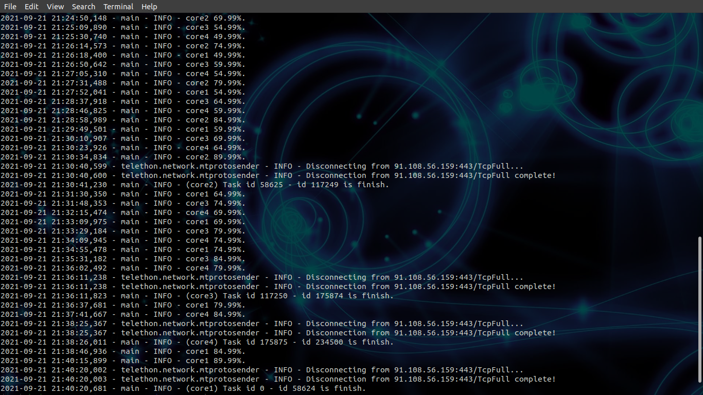

# get-telegram-group-data

## What can this project do?
With these project you can get data in csv file from your telegram group. What kind of data? this data `id,reply_to_msg_id,text,first_name,last_name,username,phone,day_utc,month_utc,year_utc,hour_utc,minute_utc,second_utc`. [pythonID-58625-117249.csv](https://raw.githubusercontent.com/Hidayathamir/get-telegram-group-data/main/pythonID-0-58624.csv) is the example of data that I got from [pythonID](https://t.me/pythonID). 


## How to run this project
1. Install `requirements.txt`.
    ```
    pip3 install -r requirements.txt
    ```
2. Open [my.telegram.org](https://my.telegram.org/) in your browser to get `API_ID` and `API_HASH`.
3. In file `show_latest_id.py`
    ```
    client = TelegramClient("core4", environ["api_id"], environ["api_hash"])
    ```
    use your `API_ID` and `API_HASH`. then
    ```
    with client:
            client.loop.run_until_complete(
                show_latest_id(target_username="pythonID")
            )
    ```
    change target_username to your group username (see on group info). If your group link is `https://t.me/pythonID` then `target_username="pythonID"`.
4. Run `show_latest_id.py`
    ```
    python3 show_latest_id.py
    ```
    session file `core4.session` will be created in your directory. Input your phone number and login code from telegram.After finish `show_latest_id.py` will print latest id message in your group.
5. Do step 2 & 3 with defferent session file name, use session file name `core1`, `core2`, and `core3`. Now you have 4 session file name.
    ```
    core1.session
    core2.session
    core3.session
    core4.session
    ```
6. In `run.py`
    ```
    run_main_in_multiprocess(
        session_name=["core1", "core2", "core3", "core4"],
        api_id=environ["api_id"],
        api_hash=environ["api_hash"],
        group_link="https://t.me/pythonID",
        min_id=0,
        max_id=234500,
    )
    ```
    `session_name` is your 4 session file. `api_id` & `api_hash` you got from step 1. `group_link` is your telegram group link (in step 2). `min_id=0` mean we will get data from the first message in your group. `max_id=234500` is `max_id` message that we want to get, for me it's around 234429 so i round up to 234500.
7. Run run.py
    ```
    python3 run.py
    ```
    now wait until we got all data that we want.
    
    
    now 4 csv file will be created in your directory. There you go, now you have your data.

In my case my cpu has 4 core. That's why I create 4 session file. If you don't understand about multiprocess in python, just keep it 4 like me, you will be oke.